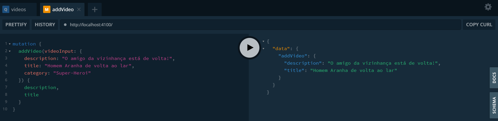
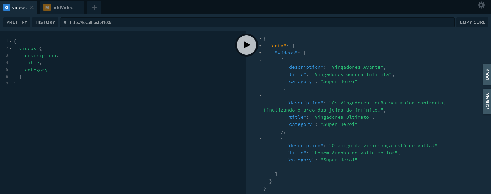

API de cadastro de videos desenvolvida para fins de estudo sobre a biblioteca TypeGraphQL.

  

  

## Tecnologias utilizadas

* __Nodejs__
* __TypeScript__
* __Apollo Server__
* __TypeGraphQL__
* __MongoDB__
